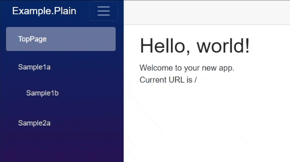

# BlazorPathHelper
[](https://www.nuget.org/packages/BlazorPathHelper/) 

 

`BlazorPathHelper` is a library that assists in managing URL paths within Blazor projects.


## Main Features
This library **automatically** generates the following contents.
* **Type-safe** URL builders from URL definitions
  * supports parameter/optional parameter/queries
* Route/Parameter/SupplyParameterFromQuery definition
* Menu structure data
  * Supports customizing menu display (icon, description, l10n, etc.)

## Documentation
See Documentation for more information.
* [English](https://arika0093.github.io/BlazorPathHelper/)
* [日本語](https://arika0093.github.io/BlazorPathHelper/ja/)

## Getting Started
### Installation
Install [BlazorPathHelper](https://www.nuget.org/packages/BlazorPathHelper/) in your Blazor project.

```bash
dotnet add package BlazorPathHelper
```
### Minimum URL Builder
Create a `WebPaths.cs` file.

```csharp
using BlazorPathHelper;

[BlazorPath] // <- Add this attribute
public partial class WebPaths
{
  // public const string (VariableName) = "/your-path";
  public const string Index = "/";
  public const string Sample = "/sample";
  public const string SampleChild = "/sample/child";
  public const string Counter = "/counter";
  public const string CounterWithState = "/counter/{count:int}";
  public const string CounterWithQuery = "/counter/query";
}
```

When defined like this, the following class definition is **automatically** generated.

```csharp
// <auto-generated />
public partial class WebPaths
{
  // Helper functions useful for building URLs
  public partial class Helper
  {
    public static string Index() => "/";
    public static string Sample() => "/sample";
    public static string SampleChild() => "/sample/child";
    public static string Counter() => "/counter";
    public static string CounterWithState(int Count)
      => string.Format("/counter/{0}", ToStringForUrl(Count));
    public static string CounterWithQuery() => "/counter/query";
  }
}
```

You can see that a URL builder that accepts an `int` type parameter has been generated for `CounterWithState`.
But `CounterWithQuery` is not yet in the form of receiving queries.
This is because it has not yet been defined what kind of query it will receive.

### With Query
So, let's define it to receive queries.

```csharp
using BlazorPathHelper;

[BlazorPath]
public partial class WebPaths
{
  public const string Index = "/";
  public const string Sample = "/sample";
  public const string SampleChild = "/sample/child";
  public const string Counter = "/counter";
  public const string CounterWithState = "/counter/{count:int}";
  [Query<QueryRecord>] // <- Add this attribute
  public const string CounterWithQuery = "/counter/query";
}

// definition for explanation
// it is recommended to specify a default value or make it nullable.
public record QueryRecord(string query = "hello", int page = 0, bool? opt = null);
```

> [!IMPORTANT]
> The class definition to be specified as a query parameter will **NOT** be generated correctly if it is described in the `.razor` file.
> This is due to the specifications of the Source Generator. (Razor files are also converted to C# by the Source Generator, so there is a conflict.)

Then, the following class definition is **automatically** generated.

```csharp
// <auto-generated />
public partial class WebPaths
{
  public partial class Helper
  {
    // Only the part that is different from before is excerpted
    public static string CounterWithQuery(QueryRecord __query)
      => string.Format("/counter/query{0}", BuildQuery([
        ToEscapedStrings("query", __query.query),
        ToEscapedStrings("page", __query.page),
        ToEscapedStrings("opt", __query.opt)
      ]));
  }
}
```

Now, the URL builder for `CounterWithQuery` can receive queries.

<details>
<summary>about query parameter specification</summary>

* Extracts the fields/properties of the specified class and makes them available as query parameters.
  * Note that this is **NOT** a feature that restores the class as it is.
* Supports types such as `string`/`int`/`bool?`/`string[]`.
  * If an array is specified, the URL will be `?key=value1&key=value2&...`.
* Only top-level members are supported. Nested classes are not supported.
* If you want to shorten the name of the URL part, you can specify it as follows.

```csharp
public record QueryRecord
{
  [SupplyParameterFromQuery(Name = "q")] // -> URL key is "q"
  public string query { get; set; } = "hello";
  [SupplyParameterFromQuery(Name = "p")]
  public int page { get; set; } = 0;
  [SupplyParameterFromQuery(Name = "o")]
  public bool? opt { get; set; } = null;
}
// -> /counter/query?q=hello&p=0&o=true
```

</details>


### URL Builder Usage
`(ClassName).Helper.(VariableName)` is the URL builder function.
You can use it as follows.

```csharp
// Generate URL
var homeUrl = WebPaths.Helper.Index();
var counterStateUrl = WebPaths.Helper.CounterWithState(1);
var counterQueryUrl1 = WebPaths.Helper.CounterWithQuery(new());
var counterQueryUrl2 = WebPaths.Helper.CounterWithQuery(new() { query = "test" });
var counterQueryUrl3 = WebPaths.Helper.CounterWithQuery(new() { query = "foo", page = 1, opt = true });

Console.WriteLine(homeUrl);          // -> "/"
Console.WriteLine(counterStateUrl);  // -> "/counter/1"
Console.WriteLine(counterQueryUrl1); // -> "/counter/query?query=hello&page=0"
Console.WriteLine(counterQueryUrl2); // -> "/counter/query?query=test&page=0"
Console.WriteLine(counterQueryUrl3); // -> "/counter/query?query=foo&page=1&opt=true"

// navigate to page
// @inject NavigationManager Nav
Nav.NavigateTo(counterStateUrl);
```


### Automatic Page Attribute Specification
You need to specify attributes such as `@page`, `[Parameter]` and `[SupplyParameterFromQuery]` on the Blazor page side, but these can also be automatically generated.
Specify `[Page<PageComponent>]` as follows.

```csharp
using BlazorPathHelper;
using Microsoft.AspNetCore.Components;

[BlazorPath]
public partial class WebPaths
{
  [Page<Home>] // <- Add `Page<PageComponent>` attribute
  public const string Index = "/";
  [Page<Sample>]
  public const string Sample = "/sample";
  [Page<SampleChild>]
  public const string SampleChild = "/sample/child";
  [Page<Counter>]
  public const string Counter = "/counter";
  [Page<Counter2>]
  public const string CounterWithState = "/counter/{count:int}";
  [Page<Counter3>, Query<QueryRecord>]
  public const string CounterWithQuery = "/counter/query";
}

// -------
// definition for explanation (actually defined in each component)
public partial class Home : ComponentBase;
public partial class Sample : ComponentBase;
public partial class SampleChild : ComponentBase;
public partial class Counter : ComponentBase;
public partial class Counter2 : ComponentBase;
public partial class Counter3 : ComponentBase;
public record QueryRecord(string query = "hello", int page = 0, bool? opt = null);
```

So the following class definition is automatically generated.
For query parameters, if an initial value is specified, that value is automatically set as the default value.

```csharp
// <auto-generated />
// -------------------
// Index(Home)
[Route("/")] // -> be equal to [@page "/"] in .razor file
public partial class Home;
// -------------------
// omitting the definition of Sample, SampleChild, Counter
// -------------------
// CounterWithState(Counter2)
[Route("/counter/{count:int}")]
public partial class Counter2
{
  // automatically defined as a parameter
  [Parameter]
  public int Count { get; set; }
}
// -------------------
// CounterWithQuery(Counter3)
[Route("/counter/query")]
public partial class Counter3
{
  // automatically defined as a query parameter
  [SupplyParameterFromQuery]
  public string Query { get; set; } = "hello";
  [SupplyParameterFromQuery]
  public int Page { get; set; } = 0;
  [SupplyParameterFromQuery]
  public bool? Opt { get; set; } = null;
}
```

Now, the page attributes are automatically set, so you don't have to write them in the `.razor` file.
`@page` attribute can be removed from the `.razor` file.

> [!TIP]
> Automatic generation by `Page` attribute specification is a completely independent feature.
> Therefore, you can remove the `Page` attribute at any time if you do not need the automatic definition.


### Menu Structure Automatic Generation
The menu structure data is also automatically generated. This is useful for dynamically creating menus.

#### Basic Usage
As usual, add the `Item` attribute to the `WebPaths.cs` file.

```csharp
using BlazorPathHelper;

[BlazorPath] // <- Add this attribute
public partial class WebPaths
{
  // add [Item("Menu name")] attribute
  // [Page]/[Query] attribute is not required. this is an independent feature.
  [Item("TopPage"),  Page<Home>]
  public const string Index = "/";
  [Item("Sample1a"), Page<Sample>]
  public const string Sample = "/sample";
  [Item("Sample1b"), Page<SampleChild>]
  public const string SampleChild = "/sample/child";
  [Item("Sample2a"), Page<Counter>]
  public const string Counter = "/counter";
  [Item("Sample2b"), Page<Counter2>]
  public const string CounterWithState = "/counter/{count:int}";
  [Item("Sample2c"), Page<Counter3>, Query<QueryRecord>]
  public const string CounterWithQuery = "/counter/query";
}
```

Then, the following class definition is automatically generated.

```csharp
// <auto-generated />
public partial class WebPaths
{
  // An array useful for dynamically creating menu items
  public static readonly BlazorMenuItem[] MenuItem = [
    new BlazorPathMenuItem(){
      Name = "TopPage", // Menu name. Defaults to the variable name
      Path = "/",       // Page path
      Children = []     // Submenus
      // Other properties automatically generated to assist in menu creation
    },
    new BlazorPathMenuItem(){
      Name = "Sample1a",
      Path = "/sample", 
      // Parses the URL and intelligently generates submenus
      Children = [
        new BlazorPathMenuItem(){
          Name = "Sample1b",
          Path = "/sample/child", 
          Children = []
        }
      ]
    },
    new BlazorPathMenuItem(){
      Name = "Sample2a",
      Path = "/counter",
      // Pages with parameters/queries are not displayed in the menu
      Children = []
    }
  ]
}
```

Here, only the menu structure data is generated, and you need to implement the menu display separately.
In other words, you can create menus using any framework, and it's up to you!

Now, let's show you an implementation example.

```razor
@* NavMenuItem.razor *@
@using BlazorPathHelper

@foreach(var menuItem in MenuItems)
{
  @* key attribute can use MenuItem.Key *@
  <div @key=menuItem.Key class="nav-item ps-3 py-1">
    @* itself link *@
    @* NavLinkMatch.All is used for the top page *@
    <NavLink class="nav-link" href="@menuItem.Path"
             Match="@(menuItem.IsHome ? NavLinkMatch.All : NavLinkMatch.Prefix)">
      @* icon and name *@
      <span class="me-2 fs-5 @menuItem.Icon" aria-hidden="true"></span>
      @menuItem.Name
    </NavLink>
    @* children items call recursively *@
    <nav class="flex-column">
      <NavMenuItem MenuItems="menuItem.Children"/>
    </nav>
  </div>
}

@code {
  [Parameter, EditorRequired]
  public BlazorPathMenuItem[] MenuItems { get; set; } = [];
}
```

and use it as follows.

```razor
@* your menu location *@
<NavMenuItem MenuItems="@WebPaths.MenuItem"/>
```

You can create menus like this!




#### Menu Customization
You can customize menu display using the `Item` attribute.

```csharp
[BlazorPath]
public partial class WebPaths
{
  // To hide from the menu, specify Visible = false
  [Item(Visible = false)]
  public const string Index = "/";

  // Specify page name and icon (CSS class)
  [Item("SampleA", Icon = "fas fa-cog")]
  public const string Sample = "/sample";
  [Item("SampleA-1", Icon = "fas fa-star")]
  public const string SampleChild1 = "/sample/child1";

  // ... or specify the icon as a Type (for FluentUI, etc.)
  // usage. Icon="@((Icon?)MenuItem.Icon)"
  [Item<Icon.Home>("SampleWithTypeIcon")]
  public const string SampleWithTypeIcon = "/sample/icontype";

  // To add a description, specify it as the Description
  [Item("SampleA-2", Description = "Description of the A-2 page")]
  public const string SampleWithDesc = "/sample/child2";

  // To recognize as a child element without URL connection, specify Group
  [Item("SampleA-3", Group = Sample)]
  public const string SampleChild3 = "/sample-3";

  // To display a deeply nested hierarchy that is not connected
  // to anything as a top-level menu, specify Group = "/"
  [Item("SampleB", Group = Index)]
  public const string SuperInnerItem = "/hoge/fuga/piyo";

  // If specified as above, child pages will also be displayed in the menu
  [Item("SampleB-1")]
  public const string SuperInnerItemChild = "/hoge/fuga/piyo/child";

  // For i10n support, use nameof to specify resource keys and use IStringLocalizer in components.
  // example.
  // @inject ILocalizer<Resources> Localizer
  // <NavLink href="@MenuItem.Path">@Localizer[MenuItem.Name]</NavLink>
  [Item(nameof(Resources.SampleTitle))]
  public const string SampleLocalize = "/sample-l10n";
  [Item(nameof(Resources.SampleTitle), Description = nameof(Resources.SampleDesc))]
  public const string SampleLocalizeWithDesc = "/sample-l10n-plus";
}
```

