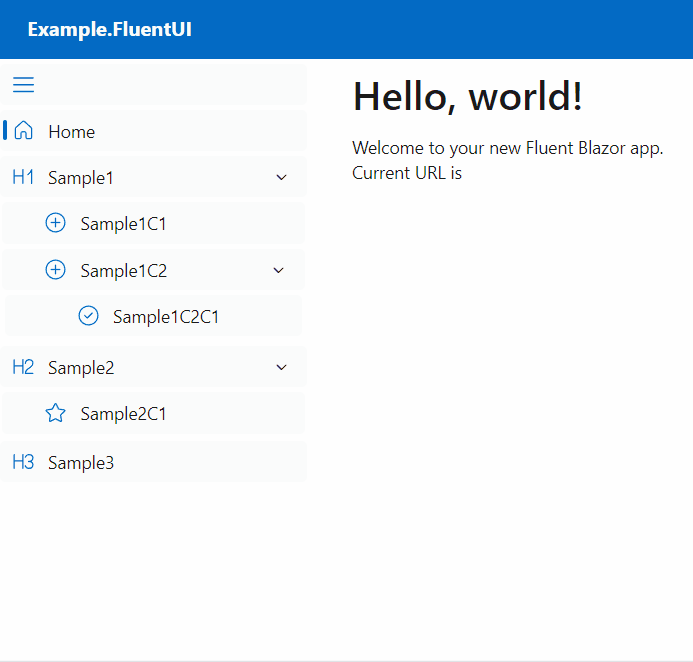

# Integrating Fluent UI

## Prerequisites

Create a project using the [official template](https://www.fluentui-blazor.net/CodeSetup).

```bash
# Installing the FluentUI template
dotnet new install Microsoft.FluentUI.AspNetCore.Templates
dotnet new fluentblazorwasm --name MyApplication
```

## Creating WebPaths.cs

Create `WebPaths.cs` to define URL paths. Unlike other frameworks, FluentUI's `Icon` is defined as a class rather than a string, so you can't specify it directly. Therefore, specify the icon class in a generic format. Use [FluentUI Icons](https://www.fluentui-blazor.net/Icon) for icon definitions. For detailed configuration, refer to [Menu Item Customization](../MenuCustomization.md).

```csharp
using BlazorPathHelper;
// Use static to simplify icon definitions
using static Microsoft.FluentUI.AspNetCore.Components.Icons.Regular.Size20;

[BlazorPath]
public partial class WebPaths
{
    [Item<Home>("Home")]
    public const string Home = "/";
    [Item<TextHeader1>("Sample1")]
    public const string Sample1 = "/sample1";
    [Item<AddCircle>("Sample1C1")]
    public const string Sample1C1 = $"{Sample1}/child1";
    [Item<AddCircle>("Sample1C2")]
    public const string Sample1C2 = $"{Sample1}/child2";
    [Item<CheckmarkCircle>("Sample1C2C1")]
    public const string Sample1C2C1 = $"{Sample1}/child2/child1";
    [Item<TextHeader2>("Sample2")]
    public const string Sample2 = "/sample2";
    [Item<Star>("Sample2C1")]
    public const string Sample2C1 = $"{Sample2}/child1";
    [Item<TextHeader3>("Sample3")]
    public const string Sample3 = "/sample3";
}
```

## Creating the Menu Component

Create `NavMenuItem.razor` to display the menu component.

```razor
@using BlazorPathHelper

@foreach(var menuItem in MenuItems)
{
  <!-- Handle cases with and without child elements separately -->
  @if(menuItem.HasChildren)
  {
    <!-- Use menuItem.Key for defining the key attribute -->
    <!-- menuItem.Path represents the URL path of the menu item -->
    <!-- Cast Icon to use it since it's of type object? -->
    <FluentNavGroup @key=@menuItem.Key Href="@menuItem.Path"
        Title="@menuItem.Name" Icon="@((Icon?)menuItem.Icon)">
      <!-- Recursively call to display child elements -->
      <NavMenuItem MenuItems="menuItem.Children"/>
    </FluentNavGroup>
  }
  else
  {
    <!-- Apply NavLinkMatch.All only to the homepage, use Prefix otherwise -->
    <FluentNavLink @key=@menuItem.Key Href="@menuItem.Path"
        Match="@(menuItem.IsHome ? NavLinkMatch.All : NavLinkMatch.Prefix)"
        Icon="@((Icon?)menuItem.Icon)" IconColor="Color.Accent">
      @menuItem.Name
    </FluentNavLink>
  }
}

@code {
  // Receive an array of menu items
  [Parameter, EditorRequired]
  public BlazorPathMenuItem[] MenuItems { get; set; } = [];
}
```

## Displaying the Menu

Add the menu display component to `MainLayout.razor`.

```razor
<!-- Omitted -->
<FluentNavMenu Id="main-menu" Width="250" Collapsible="true"
               Title="Navigation menu" CustomToggle="true">
  <NavMenuItem MenuItems="WebPaths.MenuItem"/>
</FluentNavMenu>
<!-- Omitted -->
```

## Execution Result



## Source Code

You can find an implementation example at [Example.FluentUI](https://github.com/arika0093/BlazorPathHelper/tree/main/examples/Example.FluentUI/).