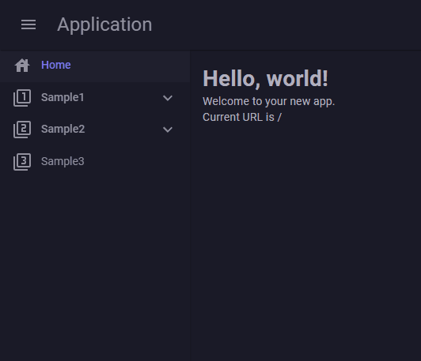

# Integrating with MudBlazor

## Prerequisites

Create a project using the [official template](https://mudblazor.com/getting-started/installation#using-templates).

```bash
# Installing the MudBlazor template
dotnet new install MudBlazor.Templates
dotnet new mudblazor --interactivity Auto --name MyApplication --all-interactive
```

## Creating WebPaths.cs

Create `WebPaths.cs` to define URL paths. Use [MudBlazor Icons](https://mudblazor.com/features/icons) for icon definitions. For detailed configuration, refer to [Menu Item Customization](../MenuCustomization.md).

```csharp
using BlazorPathHelper;
// Use static imports to simplify icon definitions
using static MudBlazor.Icons.Material.Filled;

[BlazorPath]
public partial class WebPaths
{
    [Item("Home", Icon = House)]
    public const string Home = "/";
    [Item("Sample1", Icon = Filter1)]
    public const string Sample1 = "/sample1";
    [Item("Sample1C1", Icon = ExposurePlus1)]
    public const string Sample1C1 = $"{Sample1}/child1";
    [Item("Sample1C2", Icon = ExposurePlus2)]
    public const string Sample1C2 = $"{Sample1}/child2";
    [Item("Sample1C2C1", Icon = StarBorder)]
    public const string Sample1C2C1 = $"{Sample1}/child2/child1";
    [Item("Sample2", Icon = Filter2)]
    public const string Sample2 = "/sample2";
    [Item("Sample2C1", Icon = _1xMobiledata)]
    public const string Sample2C1 = $"{Sample2}/child1";
    [Item("Sample3", Icon = Filter3)]
    public const string Sample3 = "/sample3";
}
```

## Creating the Menu Component

Create `NavMenu.razor` to display the menu component.

```razor
@using BlazorPathHelper
@using global::MudBlazor

@foreach(var menuItem in MenuItems)
{
  @if (menuItem.HasChildren)
  {
    <MudNavGroup Title="@menuItem.Name" Icon="@menuItem.Icon?.ToString()" 
                 Expanded="true" ExpandIcon="@Icons.Material.Filled.ExpandMore">
      <NavMenu MenuItems="@menuItem.Children" />
    </MudNavGroup>
  }
  else
  {
    <MudNavLink Href="@menuItem.Path" Icon="@menuItem.Icon?.ToString()" 
                Match="@(menuItem.IsHome ? NavLinkMatch.All : NavLinkMatch.Prefix)">
      @menuItem.Name
    </MudNavLink>
  }
}

@code {
  [Parameter, EditorRequired]
  public BlazorPathMenuItem[] MenuItems { get; set; } = [];
}
```

## Displaying the Menu

Add the menu component to `MainLayout.razor`.

```razor
<!-- Omitted -->
<MudDrawer @bind-Open="_drawerOpen" ClipMode="DrawerClipMode.Always" Elevation="2">
  <MudNavMenu>
    <NavMenu MenuItems="WebPaths.MenuItem"/>
  </MudNavMenu>
</MudDrawer>
<!-- Omitted -->
```

## Result



## Notes

In this example, elements like Sample1 that have submenus do not have links assigned. This is because MudBlazor does not provide an API to set links for elements with submenus.

## Source Code

You can find an implementation example at [Example.MudBlazor](https://github.com/arika0093/BlazorPathHelper/tree/main/examples/Example.MudBlazor/).