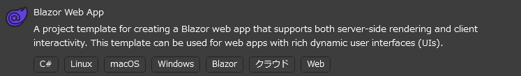

## 前提

Visual Studio 2022のBlazorテンプレートを使用してプロジェクトを作成します。



## 事前準備

標準テンプレートにはアイコンが含まれていないため、`wwwroot/index.html` に以下を追加します。

```html
<head>
    <!-- 追加 -->
    <link rel="stylesheet" href="https://cdn.jsdelivr.net/npm/bootstrap-icons@1.11.3/font/bootstrap-icons.min.css">
</head>
```

これで、Bootstrap Iconsが使用できるようになります。

## WebPaths.csの作成

`WebPaths.cs` を作成し、URLパスを定義します。
アイコン定義は[Bootstrap Icons](https://icons.getbootstrap.com/)を使用します。
詳細な設定方法は [メニュー項目カスタマイズ](../MenuCustomization.md) を参照してください。

```csharp title="WebPaths.cs"
using BlazorPathHelper;

[BlazorPath]
public partial class WebPaths
{
    [Item("Home", Icon = "bi-house-door-fill")]
    public const string Home = "/";
    [Item("Sample1", Icon = "bi-1-circle-fill")]
    public const string Sample1 = "/sample1";
    [Item("Sample1C1", Icon = "bi-1-square")]
    public const string Sample1C1 = $"{Sample1}/child1";
    [Item("Sample1C2", Icon = "bi-2-square")]
    public const string Sample1C2 = $"{Sample1}/child2";
    [Item("Sample1C2C1", Icon = "bi-bag-plus")]
    public const string Sample1C2C1 = $"{Sample1}/child2/child1";
    [Item("Sample2", Icon = "bi-2-circle-fill")]
    public const string Sample2 = "/sample2";
    [Item("Sample2C1", Icon = "bi-1-square")]
    public const string Sample2C1 = $"{Sample2}/child1";
    [Item("Sample3", Icon = "bi-3-circle-fill")]
    public const string Sample3 = "/sample3";
}
```

## メニューコンポーネントの作成

`NavMenuItem.razor` を作成し、メニューを表示するコンポーネントを作成します。

```razor title="NavMenuItem.razor"
@using BlazorPathHelper

@foreach(var menuItem in MenuItems)
{
  <!-- key属性の定義には menuItem.Key が使えます -->
  <div @key=menuItem.Key class="nav-item ps-3 py-1">
    <!-- menuItem.Path はメニューアイテムのURLパスを表します -->
    <!-- NavLinkMatch.All はトップページにのみ適用し、それ以外はPrefixを使用 -->
    <NavLink class="nav-link" href="@menuItem.Path"
             Match="@(menuItem.IsHome ? NavLinkMatch.All : NavLinkMatch.Prefix)">
      <!-- アイコンおよびメニュー名は文字列で渡されます -->
      <span class="me-2 fs-5 @menuItem.Icon" aria-hidden="true"></span>
      @menuItem.Name
    </NavLink>
    <!-- 子要素を表示するために、再帰的に呼び出します -->
    <nav class="flex-column">
      <NavMenuItem MenuItems="menuItem.Children"/>
    </nav>
  </div>
}

@code {
  // メニューアイテムの配列を受け取ります
  [Parameter, EditorRequired]
  public BlazorPathMenuItem[] MenuItems { get; set; } = [];
}
```

## メニューの表示

`MainLayout.razor` にメニューを表示するコンポーネントを追加します。

```razor title="MainLayout.razor"
<!-- 省略 -->
<div class="@NavMenuCssClass nav-scrollable">
    <nav class="flex-column pe-3">
        <NavMenuItem MenuItems="WebPaths.MenuItem"/>
    </nav>
</div>
<!-- 省略 -->
```

## 実行結果

{: style="width: 400px;" }


## ソースコード
実装例は [Example.Plain](https://github.com/arika0093/BlazorPathHelper/tree/main/examples/Example.Plain/) で利用できます。
