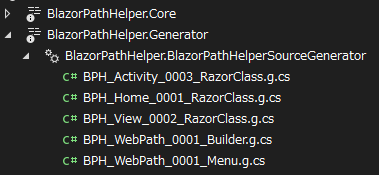

## 設定方法
`.csproj` ファイルに以下の属性を追加することで、自動生成されたコードを確認できます。

```xml title="project.csproj"
<PropertyGroup>
  <EmitCompilerGeneratedFiles>true</EmitCompilerGeneratedFiles>
</PropertyGroup>
```

## 閲覧
生成されたファイルは`Dependencies`>`Analyzer`>`BlazorPathHelper.Generator`の下に表示されます。



例えば、URLビルダーを定義した`WebPaths.cs`を作成した場合、以下のようなファイルが生成されます。

```csharp title="Auto Generated Code"
// <auto-generated />
#nullable enable
#pragma warning disable CS8600
#pragma warning disable CS8601
#pragma warning disable CS8602
#pragma warning disable CS8603
#pragma warning disable CS8604
using System;
using static BlazorPathHelper.BlazorPathHelperUtility;

namespace Example.MudBlazor;

public partial class WebPaths
{
    /// <summary>
    /// Helper class for path building
    /// </summary>
    public static partial class Helper
    {
        /// <summary>Build Path String: / </summary>
        public static string Home() => "/";
        /// <summary>Build Path String: /sample1 </summary>
        public static string Sample1() => "/sample1";
        /// <summary>Build Path String: /sample1/child1 </summary>
        public static string Sample1C1() => "/sample1/child1";
        /// <summary>Build Path String: /sample1/child2 </summary>
        public static string Sample1C2() => "/sample1/child2";
        /// <summary>Build Path String: /sample1/child2/child1 </summary>
        public static string Sample1C2C1() => "/sample1/child2/child1";
        /// <summary>Build Path String: /sample2 </summary>
        public static string Sample2() => "/sample2";
        /// <summary>Build Path String: /sample2/child1 </summary>
        public static string Sample2C1() => "/sample2/child1";
        /// <summary>Build Path String: /sample3 </summary>
        public static string Sample3() => "/sample3";
        /// <summary>Build Path String: /sample3/{value:int} </summary>
        public static string Sample3Arg(int Value)
            => string.Format("/sample3/{0}", ToStringForUrl(Value));
    }
}
```

!!! tip "注意"

    一度上記のファイルをVisualStudio等で開いた場合、その後`WebPaths.cs`を編集しても自動生成されたファイルは更新されないように見える挙動を示すことがあります。
    その場合はVisualStudio等を再起動することで、正しく更新されたファイルが表示されるようになります。

