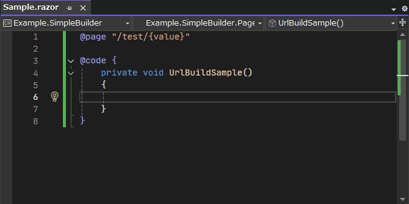

# トップページ
`BlazorPathHelper`は、Blazorプロジェクト内でのURLパスの管理を支援するライブラリです。
導入するには、 [使ってみる](./GettingStarted/simple.md) を参照してください。

!!! tip "翻訳が利用可能です"

    ドキュメントは以下の言語で利用可能です。
    [English](../index.html) | [日本語](../ja/index.html) | [简体中文](../zh/index.html)

