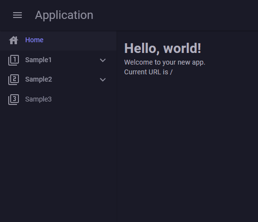

以下是将给定文本翻译成自然中文的版本：

## 前提条件

使用[官方模板](https://mudblazor.com/getting-started/installation#using-templates)创建项目。

```bash title="MudBlazor 模板的安装"
dotnet new install MudBlazor.Templates
dotnet new mudblazor --interactivity Auto --name MyApplication --all-interactive
```

## 创建 WebPaths.cs

创建 `WebPaths.cs` 并定义 URL 路径。图标定义使用 [MudBlazor Icons](https://mudblazor.com/features/icons)。详细的设置方法请参考[菜单项自定义](../MenuCustomization.md)。

```csharp title="WebPaths.cs"
using BlazorPathHelper;
// 为简化图标定义使用 using static
using static MudBlazor.Icons.Material.Filled;

[BlazorPath]
public partial class WebPaths
{
    [Item("主页", Icon = House)]
    public const string Home = "/";
    [Item("示例1", Icon = Filter1)]
    public const string Sample1 = "/sample1";
    [Item("示例1子项1", Icon = ExposurePlus1)]
    public const string Sample1C1 = $"{Sample1}/child1";
    [Item("示例1子项2", Icon = ExposurePlus2)]
    public const string Sample1C2 = $"{Sample1}/child2";
    [Item("示例1子项2子项1", Icon = StarBorder)]
    public const string Sample1C2C1 = $"{Sample1}/child2/child1";
    [Item("示例2", Icon = Filter2)]
    public const string Sample2 = "/sample2";
    [Item("示例2子项1", Icon = _1xMobiledata)]
    public const string Sample2C1 = $"{Sample2}/child1";
    [Item("示例3", Icon = Filter3)]
    public const string Sample3 = "/sample3";
}
```

## 创建菜单组件

创建 `NavMenu.razor` 以显示菜单的组件。

```razor title="NavMenu.razor"
@using BlazorPathHelper
@using global::MudBlazor

@foreach(var menuItem in MenuItems)
{
  @if (menuItem.HasChildren)
  {
    <MudNavGroup Title="@menuItem.Name" Icon="@menuItem.Icon?.ToString()" 
                 Expanded="true" ExpandIcon="@Icons.Material.Filled.ExpandMore">
      <NavMenu MenuItems="@menuItem.Children" />
    </MudNavGroup>
  }
  else
  {
    <MudNavLink Href="@menuItem.Path" Icon="@menuItem.Icon?.ToString()" 
                Match="@(menuItem.IsHome ? NavLinkMatch.All : NavLinkMatch.Prefix)">
      @menuItem.Name
    </MudNavLink>
  }
}

@code {
  [Parameter, EditorRequired]
  public BlazorPathMenuItem[] MenuItems { get; set; } = [];
}
```

## 显示菜单

在 `MainLayout.razor` 中添加显示菜单的组件。

```razor title="MainLayout.razor"
<!-- 省略 -->
<MudDrawer @bind-Open="_drawerOpen" ClipMode="DrawerClipMode.Always" Elevation="2">
  <MudNavMenu>
    <NavMenu MenuItems="WebPaths.MenuItem"/>
  </MudNavMenu>
</MudDrawer>
<!-- 省略 -->
```

## 运行结果

{: style="width: 400px;" }

## 注意事项

在这个例子中，像 Sample1 这样的具有子菜单的元素没有指定链接。这是因为 MudBlazor 没有为具有子菜单的元素提供设置链接的 API。

## 源代码

实现示例可以在 [Example.MudBlazor](https://github.com/arika0093/BlazorPathHelper/tree/main/examples/Example.MudBlazor/) 中找到。