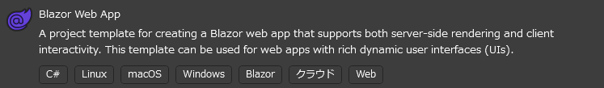
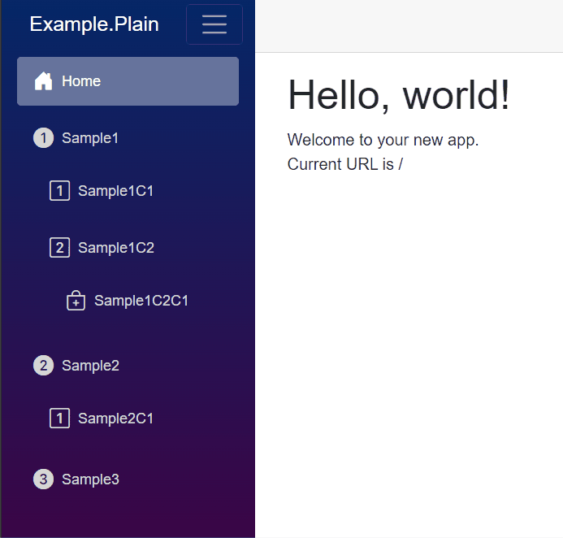

## 前提条件

使用Visual Studio 2022的Blazor模板创建项目。



## 事前准备

标准模板不包含图标，因此需要在`wwwroot/index.html`中添加以下内容：

```html
<head>
    <!-- 添加 -->
    <link rel="stylesheet" href="https://cdn.jsdelivr.net/npm/bootstrap-icons@1.11.3/font/bootstrap-icons.min.css">
</head>
```

这样就可以使用Bootstrap Icons了。

## 创建WebPaths.cs

创建`WebPaths.cs`并定义URL路径。图标定义使用[Bootstrap Icons](https://icons.getbootstrap.com/)。详细的设置方法请参阅[菜单项自定义](../MenuCustomization.md)。

```csharp title="WebPaths.cs"
using BlazorPathHelper;

[BlazorPath]
public partial class WebPaths
{
    [Item("Home", Icon = "bi-house-door-fill")]
    public const string Home = "/";
    [Item("Sample1", Icon = "bi-1-circle-fill")]
    public const string Sample1 = "/sample1";
    [Item("Sample1C1", Icon = "bi-1-square")]
    public const string Sample1C1 = $"{Sample1}/child1";
    [Item("Sample1C2", Icon = "bi-2-square")]
    public const string Sample1C2 = $"{Sample1}/child2";
    [Item("Sample1C2C1", Icon = "bi-bag-plus")]
    public const string Sample1C2C1 = $"{Sample1}/child2/child1";
    [Item("Sample2", Icon = "bi-2-circle-fill")]
    public const string Sample2 = "/sample2";
    [Item("Sample2C1", Icon = "bi-1-square")]
    public const string Sample2C1 = $"{Sample2}/child1";
    [Item("Sample3", Icon = "bi-3-circle-fill")]
    public const string Sample3 = "/sample3";
}
```

## 创建菜单组件

创建`NavMenuItem.razor`以显示菜单的组件。

```razor title="NavMenuItem.razor"
@using BlazorPathHelper

@foreach(var menuItem in MenuItems)
{
  <!-- key属性的定义使用 menuItem.Key -->
  <div @key=menuItem.Key class="nav-item ps-3 py-1">
    <!-- menuItem.Path 表示菜单项的URL路径 -->
    <!-- NavLinkMatch.All 仅适用于主页，其他使用Prefix -->
    <NavLink class="nav-link" href="@menuItem.Path"
             Match="@(menuItem.IsHome ? NavLinkMatch.All : NavLinkMatch.Prefix)">
      <!-- 图标和菜单名称以字符串形式传递 -->
      <span class="me-2 fs-5 @menuItem.Icon" aria-hidden="true"></span>
      @menuItem.Name
    </NavLink>
    <!-- 为显示子元素，递归调用 -->
    <nav class="flex-column">
      <NavMenuItem MenuItems="menuItem.Children"/>
    </nav>
  </div>
}

@code {
  // 接收菜单项数组
  [Parameter, EditorRequired]
  public BlazorPathMenuItem[] MenuItems { get; set; } = [];
}
```

## 显示菜单

在`MainLayout.razor`中添加显示菜单的组件。

```razor title="MainLayout.razor"
<!-- 省略 -->
<div class="@NavMenuCssClass nav-scrollable">
    <nav class="flex-column pe-3">
        <NavMenuItem MenuItems="WebPaths.MenuItem"/>
    </nav>
</div>
<!-- 省略 -->
```

## 运行结果

{: style="width: 400px;" }

## 源代码

实现示例可以在[Example.Plain](https://github.com/arika0093/BlazorPathHelper/tree/main/examples/Example.Plain/)中找到。