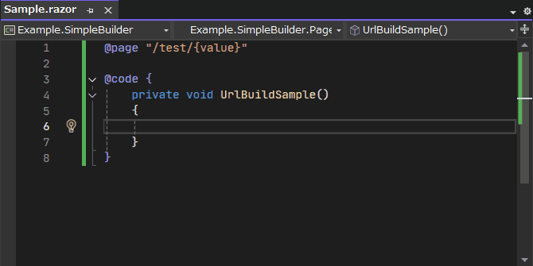

# 主页

`BlazorPathHelper` 是一个帮助管理 Blazor 项目中 URL 路径的库。要开始使用，请参阅 [开始使用](./GettingStarted/simple.md)。

!!! tip "翻译可用"

    文档提供以下语言版本：
    [English](../index.html) | [日本語](../ja/index.html) | [简体中文](../zh/index.html)

